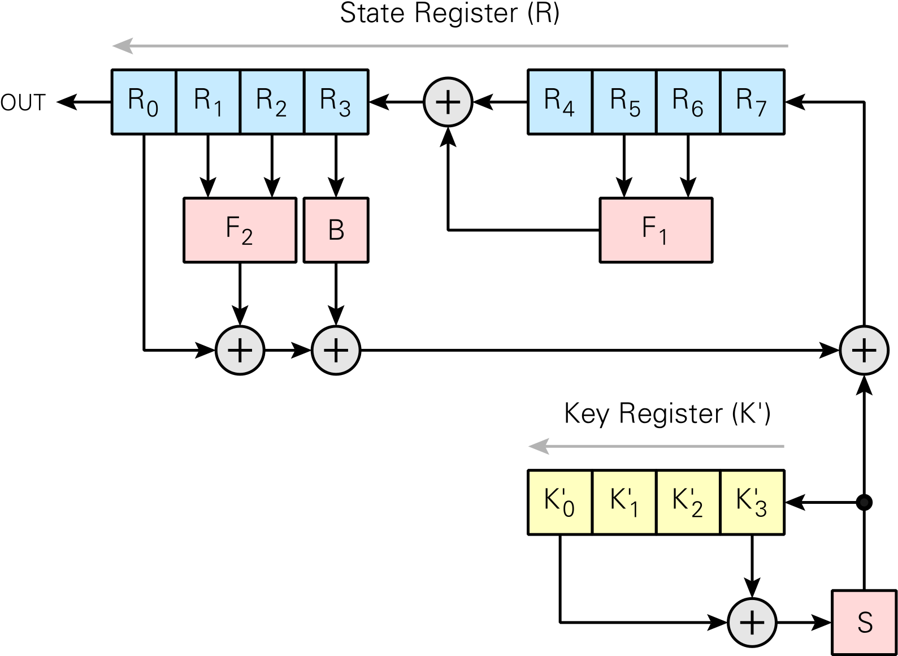

# Broadcastopol

| Category | Author | Difficulty | Solves | Points |
| -------- | ------ | ---------- | ------ | ------ |
| Crypto   | exti0p | ⭐️⭐️         | 12     | 472    |

> Le théâtre géopolitique s’est dégradé pour nous dernièrement. Un de nos alliés semble avoir modifié des équipements de communication que nous lui avons fourni initialement. En effet, depuis quelques jours nos échanges sont interrompus. En revanche, un de nos agents sur le terrain a intercepté une de leurs diffusions (`flag.wav.enc`). D’après nos renseignements, elle est d’importance tactique.
>
> Un de nos cryptographes nous a indiqué que l’algorithme de chiffrement est utilisé dans un mode de *stream cipher* classique et que nous savons que les données en clair sont des fichiers WAV. Son équipe a également réussi à obtenir un clair connu (`known.wav`/`known.wav.enc`) pour lequel nous avons connaissance de ces éléments :
>
> - `IV = 0x000dcf18` ;
> - `eck = 0x1119EB502F815EB502F8` (`eck`, *Encryption Cipher Key*).
>
> Par ailleurs, pour le message chiffré `flag.wav.enc` intercepté, les analyses opérationnelles indiquent que la valeur de l’IV devrait être `0x0026b328`.
>
> **Note :** le flag est au format `FCSC{contenu_diffusion}`. Le contenu est en anglais. Sa retranscription dans le flag est en minuscules et entre chaque mot il y a un `_`. Exemple : si j'entends "*You made good today*", le flag est : `FCSC{you_made_good_today}`.

**Challenge files:**

- `known.wav`
- `known.wav.enc`
- `flag.wav.enc`

## Write-up

**Challenge description and guessing part**

From the challenge description, we are told that a file was encrypted using a stream cipher. We are given a plaintext/ciphertext as an example along with the pair key/iv used to encrypt the file. From that, we understand that we will have to guess the stream cipher used. I first attempted without much success the following things:

- I tried to run the Berkelamp-Massey algorithm to see if the cipher was a LFSR
- I tried RC4
- Looked at some stream ciphers enlisted in the [wikipedia page](https://en.wikipedia.org/wiki/Stream_cipher)

However after thinking a bit, I stood upon the detail that the key had the unsual length of 80 bits, so I concluded that a deprecated stream cipher must have been used in the challenge. The fact that we only have a single encrypted file to be decrypted also led me in the idea that this stream cipher should also be very easy to break.

- Unfortunately another [wikipedia page](https://en.wikipedia.org/wiki/Category:Broken_stream_ciphers) did not list any relevant broken stream cipher
- And a [webpage](https://cr.yp.to/streamciphers/attacks.html) from the ECRYPT Stream Cipher Project (eSTREAM) project could not list any stream cipher broken with just a single cipher

After googling a while I finally found a [webpage](https://www.cryptomuseum.com/crypto/algo/tea/1.htm#:~:text=TEA1%2C%20short%20for%20TETRA%20Encryption,Telecommunications%20Standards%20Institute%20(ETSI).) on the TEA1 stream cipher which was identified as having an intentional backdoor. This quickly lead to a [github repository](https://github.com/MidnightBlueLabs/TETRA_crypto/tree/main) with a C implementation of the stream cipher. After running this stream cipher with the given key/iv pair I could see that the output of the stream cipher was matching the one given as an example. Hurray!

**The backdoor**

The TEA1 algorithm is a LFSR-like stream cipher with some additional non-linear layers. The weird quirck is that the 80-bit long key is first reduced to a 32-bit key which is then used in the algorithm. This means that we only need to bruteforce the reduced key in order to retrieve the plaintext.

 

**Bruteforce implementation**

The idea was to bruteforce the 4 first bytes of the stream cipher which we know because they correpond to the header of a RIFF file. 

The  [github repository](https://github.com/MidnightBlueLabs/TETRA_crypto/tree/main) already had a very well written implementation of TEA1, the only weird detail being that the non-linear layers `F1`, `F2` and `B` were regenerated at each encryption, after trivially precomputing it once, the attack was feasible in few minutes. See [source](tetracrypto/tea1.c) for the implementation. 

