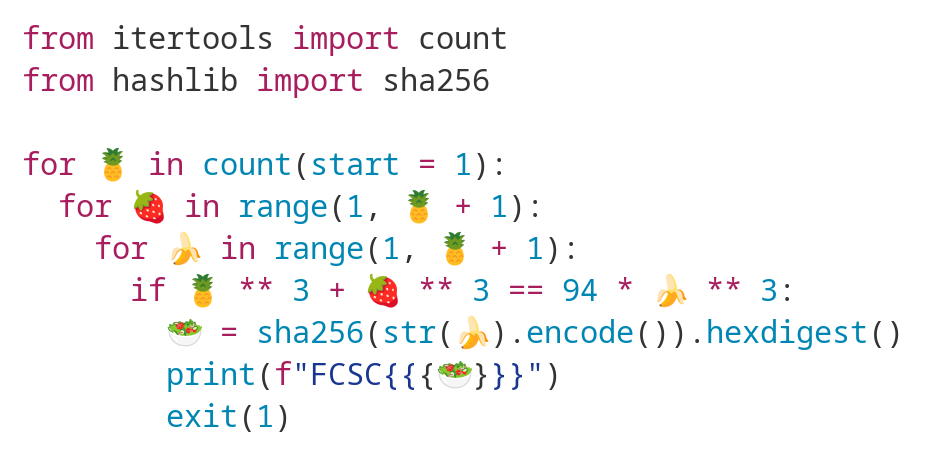

# Salade de fruits

| Category | Author | Difficulty | Solves | Points |
| -------- | ------ | ---------- | ------ | ------ |
| Crypto   | jp     | ⭐️⭐️         | 31     | 424    |

> 

**Challenge files:**

- `salade-de-fruits.py`

## Write-up

**Introduction**

The challenge description is quite straightforward, we are asked to find the smallest integer $`c`$ such that there exists positive integers $`a, b`$ satisfying $`a^3 + b^3 = 94c^3`$ . 

**Math tricks**

Obviously, we should not expect the given algorithm to output the smallest integer in reasonable time. Rather, we will need to understand the structure of the solutions to this equation. In algebraic geometry settings, it is usually more convient to study a diophantine equation on a field, so we will divide the equations by $`c^3`$ and study $`u^3 + v^3 = 94`$.

After [googling](https://math.stackexchange.com/questions/1605182/sum-of-two-cubes-transformed-to-elliptic-curve) this equation a bit,  I realized that this curve was actually birationnaly equivalent to the elliptic curve $`\mathcal E : y^2 = x^3 - 432\cdot 94^2`$ using the transformation $`u=\frac{36\cdot 94 + y}{6x}`$ and $`v=\frac{36\cdot 94 - y}{6x}`$.

Plugging that elliptic curve on sage allows to give its properties :

```python
sage: E = EllipticCurve([0, -3817152])
sage: E.gens()
[(62511752209/2480625 : -15629405421521177/3906984375 : 1)]
```

Sage informs us that the curve $`\mathcal E`$ has rank 1, and is able to compute a generator $`G`$ of the curve. From here, we can generate all the solutions of $`a^3 + b^3 = 94c^3`$ by looking at multiple of  the generators.

However, we are only interested in positive solutions $`u, v`$, this happens if, and only if its correponding point on $`\mathcal E`$ has coordinates $`(x, y)`$ satisfying $`|y| \le 36\cdot 94`$.

I then looked at multiples up to 100 of $`G`$​ and took the smallest found (which was 6509-bit long!), which solved the challenge, see [script](wu.sage).

**Aftermath: Did we really find the smallest solution?**

*Spoiler alert: Yes, but a complete rigorous proof seems hard.*

However, nothing except having the correct flag really tells us that the integer $z$ we found is indeed the *smallest* possible solution. How can that be formally proved?

My empiric explanation was that the $`x`$-coordinate of $`[n]G`$ has increasing numerators and denominators with $`n`$. This is simply because adding and doubling points on the elliptic curve will add and multiply fractions resulting in, as a *rule of thumb*, larger fractions. Therefore, our script is working because the first found positive solution on the elliptic curve has the smallest numerators and denominators so is indeed giving the smallest possible solution. But that's not a formal proof. 

There is actually some interesting math behind this intuition, one can define the *height* of a fraction $p/q$ as 

```   math
H(p/q) = \max (|p|, |q|)
```

therefore, one may define the *height (or Weil height)* of a (rational) elliptic curve point as

```math
h_x(P) = \begin{cases}
   \log H(x(P))  &\text{if $P \not= O$}\\
   0						 &\text{if $P = O$}.
\end{cases}
```

So we are interested in studying the growth of $`h_x([n]G)`$ with $`n`$.

However, mathematicians have refined this definition so that the height function satisfies some very nice properties. The *canonical height* *(or Néron-Tate height)* is defined as 

```math
\hat h(P) = \frac{1}{2} \lim_{n\to \infty} \frac {h_x([n]P)}{n^2}.
```

This can actually be computed by sage using the command `.height()`. 

```python
sage: G = E.gens()[0]
sage: G.height()
24.8624345645680
```

One elementary property we can check from the definition is that

```math
\hat h([n]P) = n^2 \hat h(P), 
```

which implies that $`\hat h`$ is an increasing function over multiples of a point! 

But how does that relate to the growth of $`h_x`$? Interestingly, it was proven by the mathematicien Néron in 1965 that the difference $h_x - \hat h$ is always bounded. More concretly, there exists some elementary bounds, the first one given by [Silverman](https://www.ams.org/journals/mcom/1990-55-192/S0025-5718-1990-1035944-5/S0025-5718-1990-1035944-5.pdf) in 1990. Amazingly, Sage can compute that bound using the command `.silverman_height_bound()`!

```python
sage: E.silverman_height_bound()
8.203075982302057
```

Combining that bound with the (canonical) height of $`G`$ *proves* that $`h_x`$ is increasing at a quadratic speed! But the proof is not over, we still need to understand the relationship between the size of points in $`\mathcal E`$ and solutions to the equation. 

Recalling that $`u= \frac{a}{c} = \frac{36\cdot 94 + y}{6x}`$ and $`v= \frac{b}{c} = \frac{36\cdot 94 - y}{6x}`$, we can notice that

```math
u + v = \frac{a+b}{c} = \frac{1128}{x},
```

however, that does not prove that the height of $`x`$ is equal to the height of $`\frac{a+b}{c}`$ since there is no reason for $`\gcd(a + b, c)`$ to be equal to $`1`$. It is actually likeky to be a large number because of the identity

```math
a^3 + b^3 = (a+b)(a^2- ab + b^2) = 94c^3,
```

so $`a+b | 94 c^3`$ and $`\gcd(a + b, c)`$ is likely to be of size $`\approx c^{1/3}`$. This seems to be true after checking over random solutions.

Accepting that approximation, this proves that the height of $[n]G$ is (asymptotically) proportional with factor $`2/3`$ to the heigth of $`c`$, which can be numerically checked!

```python
sage: def return_a_b_c (P):
....:     N = 94
....:     u, v = P[0], P[1]
....:     x, y = (36*N + v)/(6*u), (36*N - v)/(6*u)
....:     c = lcm (x.denominator(), y.denominator())
....:     a = x.numerator() * z / x.denominator()
....:     b = y.numerator() * z / y.denominator()
....:     return a, b, c # a^3 + b^3 = 94 * c^3
....: 
sage: def h(g):
....:     return max(g.numerator().bit_length(), g.denominator().bit_length())
....: 
sage: [float(h((i*G).x()) / h(return_a_b_c(i*G)[2])) for i in range (1, 10)]
[0.72,
 0.6792452830188679,
 0.6701244813278008,
 0.668997668997669,
 0.6679076693968726,
 0.6677002583979328,
 0.6671726755218216,
 0.6670540383497966,
 0.6668962350780533]

```

**Conclusion**

Therefore, we proved that the solution corresponding the points of $`[n]G`$ increases with quadratic speed, so it was reasonible to expect the first positive solution to be the smallest possible one. This could be a complete rigorous proof if one could prove that $`\gcd(a + b, c) \approx c^{1/3}`$ , if any reader of this wu had an insight I would be very interested!

**Additional Resources**

- [Optimal bounds for the difference between the Néron-Tate height and the Weil height](https://www.math.leidenuniv.nl/~pbruin/Warwick.pdf)
- [canonical height on an elliptic curve](https://planetmath.org/canonicalheightonanellipticcurve)
- [two cubes](https://web.archive.org/web/20100125133830/http://maths.paisley.ac.uk/allanm/ecrnt/twocubes/twocubes.htm)
