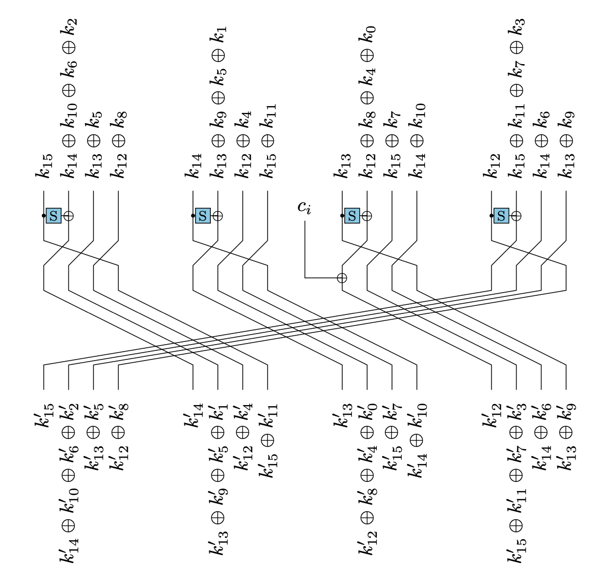

# Tight Schedule

| Category | Author | Difficulty | Solves | Points |
| -------- | ------ | ---------- | ------ | ------ |
| Crypto   | \j, hg | ⭐️⭐️⭐️        | 6      | 487    |

> Vous devez analyser ce chiffrement par bloc trafiqué par votre stagiaire Tuco, *el famoso* :-)

**Challenge files:**

- `tight-schedule.py`
- `output.txt`

## Write-up

**Introduction**

This challenge proposes to cryptanalyze the symmetric scheme introduced in `tight-schedule.py`. Given a plaintext/ciphertext pair, we have to retrieve the key used. 

Let's look at the `encrypt` function:

```python
def encrypt(self, p):
    c, sk = p, k
    for sk in self.rk[:-1]:
        c = xor(c, sk)
        for _ in range(5):
            c = self._round(c)
    return xor(c, self.rk[-1])
```

The symmetric scheme is a AES-like substitution–permutation network alternating linear mixing with the subkeys, and non linear layers with the round functions. 

Let's now have a look how the subkeys `self.rk` are generated:

```python
def expandKey(self, k):
    rk = [k]
    for _ in range(10):
        rk.append(self._round(rk[-1], self.RCON[len(rk)]))
    return rk
```

It turns out that the same round function is used to derive the subkeys. 

So we will have to look closely at the `_round` function. After all, the name of the challenge suggests that some sort of vulnerability must have been introduced here. 

```python
def _round(self, x, cst = 0):
    a, b, c, d = x[-4:]
    t = bytes([self.S[b] ^ cst, self.S[c], self.S[d], self.S[a]])
    y  = xor(x[ 0: 4], t)
    y += xor(x[ 4: 8], y[-4:])
    y += xor(x[ 8:12], y[-4:])
    y += xor(x[12:16], y[-4:])
    return y
```

The SBOX `self.S` is actually the one used by AES, so we should not expect any linear/differential attack. Playing with the `_round` function could not easily show any easy to spot pattern. However, after a while, I realized that this `_round` function is nothing more than the key scheduling algorithm used by AES-128!

**New Representations of the AES Key Schedule**

After reviewing the litterature, I found a [paper](https://eprint.iacr.org/2020/1253.pdf) detailing some stunning and beautiful properties of the AES key scheduling algorithm. The main result is that the AES key schedule $`R`$ can be decomposed as 4 affine subspaces which are shifted by $`R`$. More precisely they are able to decompose the full space as 

```math
(\mathbb{F}_{2^8})^{16} = E_0 \oplus E_1 \oplus E_2 \oplus E_3
```

so that

```math
R(x \oplus E_i) = R(x) \oplus E_{i+1}.
```

This basically means that modulo a constant, the function $`R`$ will shift $`E_{i}`$ to $`E_{i+1}`$. This is well described by the following diagram:

 

This is a beautiful and unexpected property because it implies that the round function does not mix all the bits, but 4-byte blocks by 4-byte blocks. We can also write this in terms of the canonical projections $`\pi_i : (\mathbb{F}_{2^8})^{16} \to E_i`$:

```math
\pi_{i+1}(R(x)) = R(\pi_i(x)).
```

Note that I neglicted the value `cst` in the key scheduling algorithm as it only applies a linear transformation on $`R`$ so the same properties will hold between $`\pi_i`$ and $`R`$.

**Attacking `TightSchedule`**

With that cyclic property of $`R`$ in mind, let's see how it impacts the security of `TightSchedule`. Let's see progressively what happens.

We will first adopt some notations, and write $`k_i = \pi_i(k)`$ and  $`m_i = \pi_i(m)`$ the projections for the key and message $`k, m`$. Each round of `encrypt` consists on applying 5 times the round function $`R`$, so the first round will output

``` math
c_1 := R^5(k \oplus m).
```

Now recalling that $`R`$ shifts the spaces $`E_i`$, $`R^5`$ will still shift the spaces $`E_i`$ since $`R^4`$ will stabilize the $`E_i`$. As a consequence, we will have

```math
\pi_{i+1}(c_1) = R^5(k_i \oplus m_i),
```

so the second 4-byte of the ciphertext only depends on the first 4-byte of the key, and the third 4-byte of the ciphertext only depends on the second 4-byte and so on …

The next round is a bit more complex since the intermediate ciphertext is xored with $`R(k)`$ and output

```math
c_2 := R^5(R(k)\oplus c_1).
```

 But there is something exciting happening here. Because the round key was shifted, the first 4-byte of $`R(k)\oplus c_1`$ will still only depend on the first 4-byte of the key and so forth. Thus, the same argument applies before and $`\pi_{i+2}(c_1)`$ only depend on $`k_i`$! Note that the index of $`\pi`$ has changed since $`R^5`$ has shifted once more the output. 

We can obviously repeat the argument for the 10 rounds, writing $`E(k, m)`$ the function `TightSchedule` and $`c`$ the output , we can show by induction that

```math
\pi_{i+2}(c) = E(k_i, m_i).
```

The attack is self-described as it suffices to bruteforce each 4-byte portion of the key by checking for the previous equality.

**Implementing the attack**

The attack itself is very simple because we are only required to exhaust (4 times) all potential 32-bit key, right? Well, the python's implementation was requiring more than *500* hours to run the $`2^{32}`$ calls of `encrypt`. I then panicked when I realized I would have to implement `TightSchedule` in C, knowing my taste for that programming langage. But I asked my best friend ChatGPT to do that for me and he was … AMAZING. Except some minor errors in `_round` he was able to write a complete (efficient) implementation of `encrypt`. Note that its outputs really depend on what you ask him so some work (dialogue) was obviously needed to end up with a good implementation.

At the end, my implementation was requiring … 5 minutes to bruteforce each subkey. There is actually a trick to bruteforce each subkey within a single loop. Instead of computing $`E(k_i, m_i)`$ and checking on the $`\pi_{i+2}`$-projection, we can instead compute $`E(k_0 \oplus k_1 \oplus k_2 \oplus k_3, m)`$ and check each condition. This works because the $`\pi_{i+2}`$-projection of $`E(k_0 \oplus k_1 \oplus k_2 \oplus k_3, m)`$ only depend on $`E(k_i, m_i)`$ so we can update each $`k_i`$ in parallel. This speeds up the attack by a factor of 4 which is not negligeable.

For a full implementation see [script](solution/moulinette.c).
