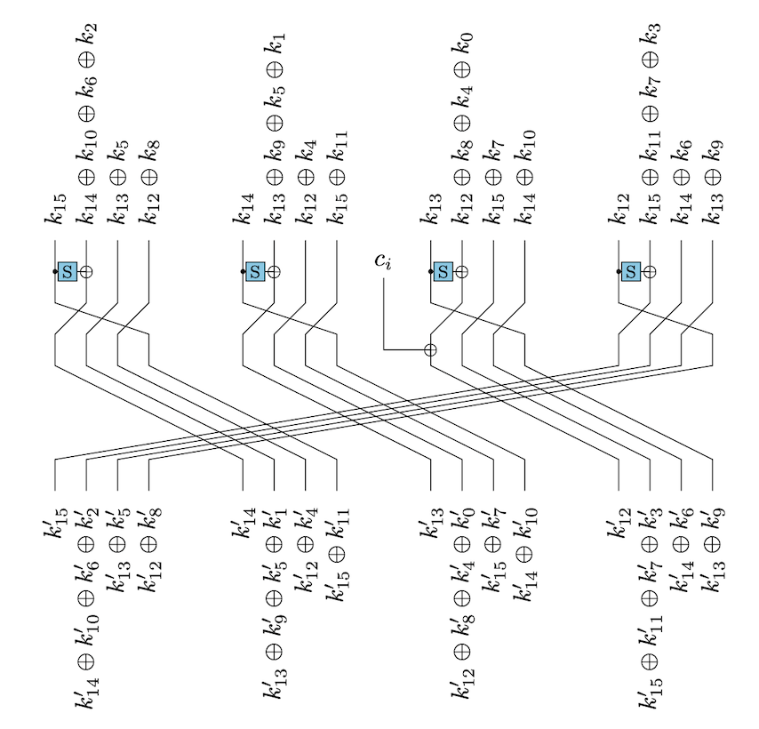

# Tight Schedule

| Category | Author | Difficulty | Solves | Points |
| -------- | ------ | ---------- | ------ | ------ |
| Crypto   | \j, hg | ⭐️⭐️⭐️        | 6      | 487    |

> Vous devez analyser ce chiffrement par bloc trafiqué par votre stagiaire Tuco, *el famoso* :-)

**Challenge files:**

- `tight-schedule.py`
- `output.txt`

## Write-up

**Introduction**

This challenge proposes to cryptanalyze the symmetric scheme introduced in `tight-schedule.py`. Given a plaintext/ciphertext pair, we have to retrieve the key used. 

Let's look at the `encrypt` function:

```python
def encrypt(self, p):
    c, sk = p, k
    for sk in self.rk[:-1]:
        c = xor(c, sk)
        for _ in range(5):
            c = self._round(c)
    return xor(c, self.rk[-1])
```

The symmetric scheme is a schoolbook AES-like substitution–permutation network alternating linear mixing with the subkeys, and non linear layers with the round functions. 

Let's now have a look how the subkeys `self.rk` are generated:

```python
def expandKey(self, k):
    rk = [k]
    for _ in range(10):
        rk.append(self._round(rk[-1], self.RCON[len(rk)]))
    return rk
```

It turns out that the same round function is used to derive the subkeys. 

So we will have to have a deep dive look into the `_round` function. After all, the name of the challenge suggests that some sort of vulnerability must have been introcuded here. 

```python
def _round(self, x, cst = 0):
    a, b, c, d = x[-4:]
    t = bytes([self.S[b] ^ cst, self.S[c], self.S[d], self.S[a]])
    y  = xor(x[ 0: 4], t)
    y += xor(x[ 4: 8], y[-4:])
    y += xor(x[ 8:12], y[-4:])
    y += xor(x[12:16], y[-4:])
    return y
```

The SBOX `self.S` is actually the one used by AES, so we should not expect any linear/differential attack. Playing with the `_round` function could not easily show any easy to spot pattern. However, after a while, I realized that this `_round` function is nothing more than the key scheduling algorithm used by AES-128!

**New Representations of the AES Key Schedule**

After reviewing the litterature, I found a [paper](https://eprint.iacr.org/2020/1253.pdf) detailing some stunning and beautiful properties of the AES key scheduling algorithm. The main result is that the AES key schedule $`R`$ can be decomposed as 4 transitive affine subspaces. More precisely they are able to decompose the full space as 

```math
(\mathbb{F}_{2^8})^{16} = E_0 \oplus E_1 \oplus E_2 \oplus E_3
```

 so that

```math
R(x \oplus E_i) = R(x) \oplus E_{i+1}.
```

 This basically means that modulo a constant, the function $`R`$ will transport the space $`E_{i}`$ to  $`E_{i+1}`$. This is well described by the following diagram:

 

